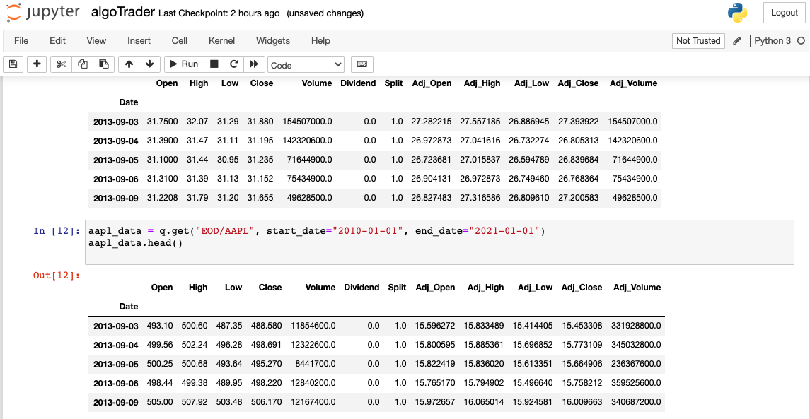

Day 2 - Aug 05 2021 

The day began with creating a new Jupyter notebook. 

I had installed Python 2.7 and some version of Jupyter previously so I had to update to Python 3.7. Also had to update Jupyter and Pip 

` python3 -m pip install --upgrade pip`
`python3 -m pip install --upgrade jupyter`

Then installed necessary python libraries.
`pip install pandas`
`pip install quandl`
`pip install numpy`

Then created the notebook algoTrader by typing `jupyter-notebook algoTrader` in the terminal.

Further following the tutorial at [Free Code Camp](https://www.freecodecamp.org/news/algorithmic-trading-in-python/) I began typing Python code in
the new Jupyter notebook.

`import pandas as pd`
`import quandl as q`
`q.ApiConfig.api_key = "Your_Quandl_API_KEY_HERE" `

Begin grabbing data from Microsoft and Apple by their respective ticker symbols MSFT and AAPL.
`msft_data = q.get("EOD/MSFT", start_date="2010-01-01", end_date="2021-01-01")`
`aapl_data = q.get("EOD/AAPL", start_date="2010-01-01", end_date="2021-01-01")`

Now, the data is random because we are not paying for Quandl services. There are premium, paid data sets available though. 

And finally seeing 5 rows of data
`msft_data.head()`
`aapl_data.head()`

And then we get to this output: 

