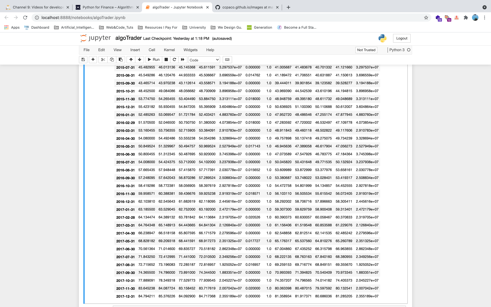

We start the day off using 

`msft_data.describe()`
 
 
`aapl_data.describe()`

to see some statistics like mean, standard deviation, min, max, and the 25% and 75% quartiles.

And we see the following output:

")

So for statistics type calculations, we can see the benefit of .describe().

There is also the benefit of .resample(), which expands the time range of data we can observe!

Good afternoon from the Pacific

Chris
