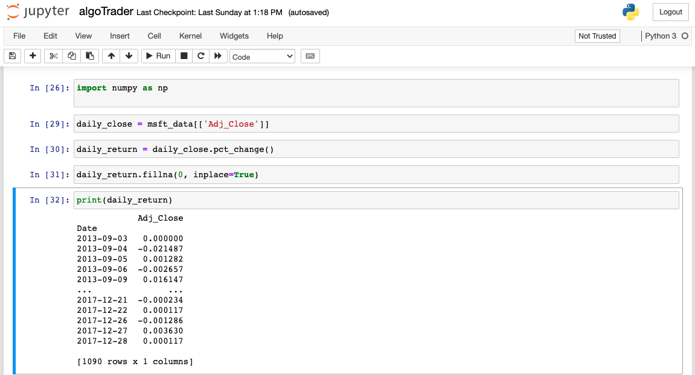
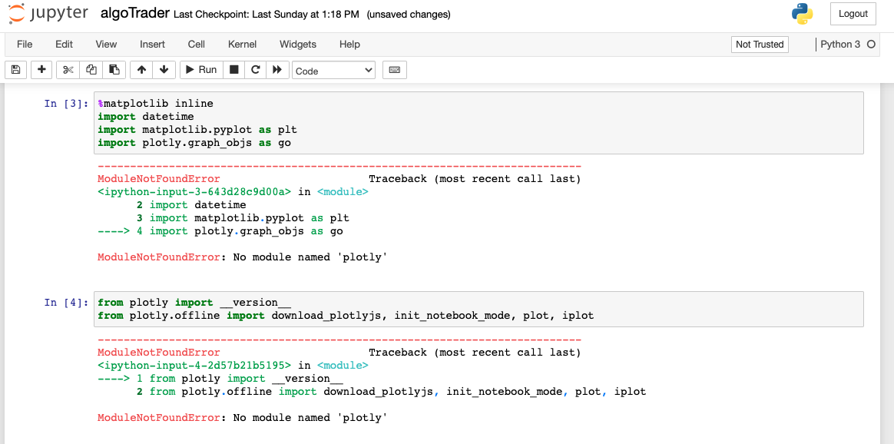

Today I continued along with the tutorial by first importing the numpy library.

:snake: `import numpy as np`

Then we assign Adj_Close to daily_close for both Microsoft and Apple.

:snake: `daily_close = msft_data[['Adj_Close']]`

We can't do this for aapl, we would need a new variable name here. So we'll only use Microsoft data to simplify things.

:snake: `daily_return = daily_close.pct_change()`

:snake: `daily_return.fillna(0, inplace=True)`

:snake: `print(daily_return)`

So next we have set our daily_return, replaced NA values with 0, and printing out the daily_return. The result is as follows. 

(In the tutorial, at this point there is an error. adj_pricesadj_price = msft_data['Adj_Close'] should be instead adj_price = msft_data['Adj_Close'])

:snake: `adj_price = msft_data['Adj_Close']`

:snake: `mav = adj_price.rolling(window=50).mean()`

A few lines of Python more, and we get to plotting. Follow along.

In the command line first, run pip install matplotlib and brew install python-matplotlib.

:snake: `pip install matplotlib`

:snake: `brew install python-matplotlib`

:snake: `import matplotlib.pyplot as plt`

:snake: `adj_price.plot()`

:snake: `mav.plot()`

By this point we've got some nice charting going on from our captured Microsoft data. This is day 4 of creating a Python algorithmic trading advisor.
Data Science is wonderfully simplified in modern years. If I can learn this, you can too.

Actually, we've encountered some errors install matplotlib. Current output is as show. Perhaps I can get some help.

Good Evening from the Pacific

Chris
