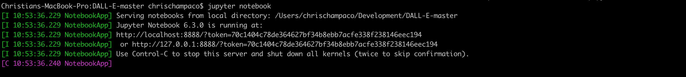
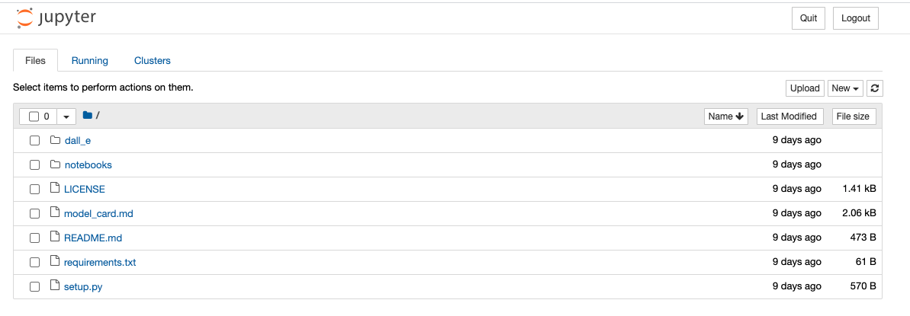

As listed on the Github repo's README.md file, 

"This is the official PyTorch package for the discrete VAE used for DALL·E. 
The transformer used to generate the images from the text is not part of this code release."

First things first, let's fork the repo from [the OpenAI github repo](https://github.com/openai/DALL-E)

I just downloaded the code, opened the zip in the same folder area as my other Python notebooks, and typed in 

`pip install DALL-E`

As per README file on the github repo. Since I'm on a Mac (using iterm2) I then type

`cd DALL-E-master`

To get into the DALL-E folder on my Mac. Then 

`jupyter notebook`

to get our DALL-E clone up and running. Quite simple so far. Output shown below.

Then we navigate to the usage.ipynb notebook and see the following code output.

Good morning from the Pacific

Chris
