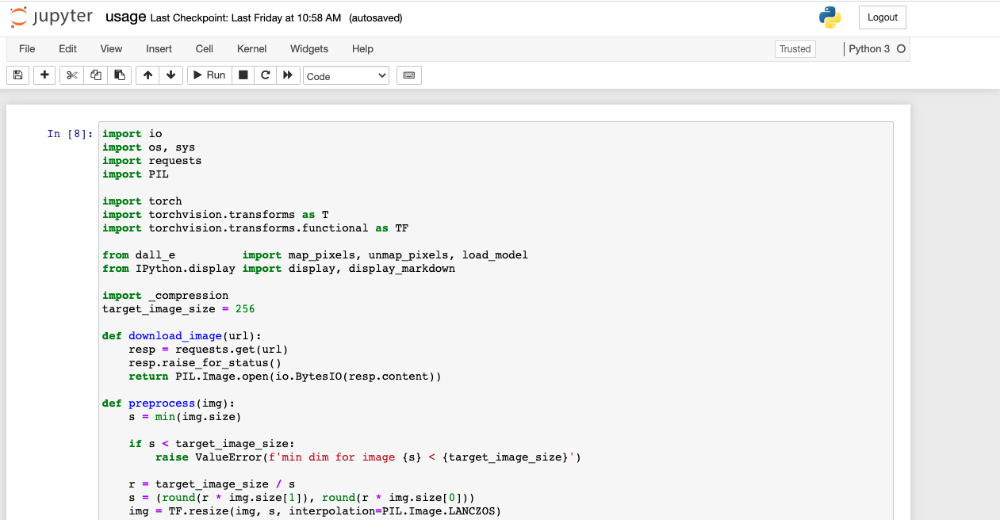
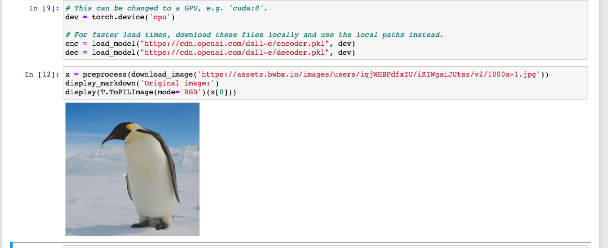
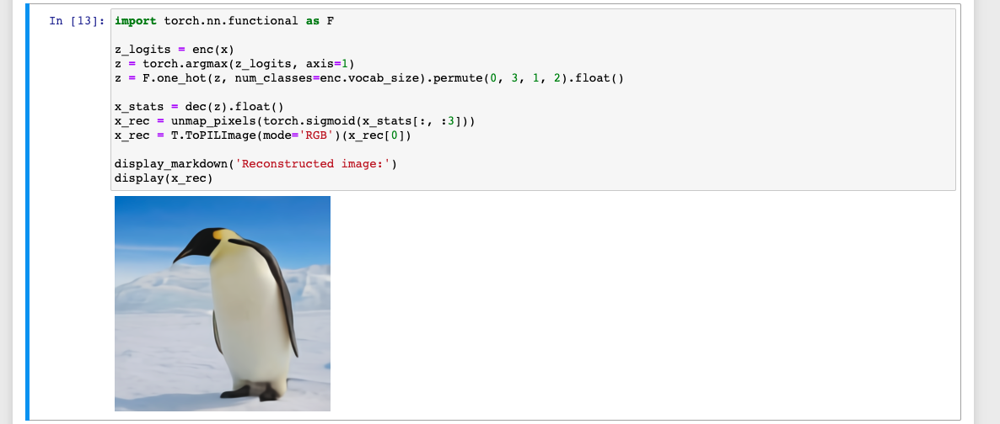

So, today (04/10/21), we have some odd developments. As I continued my research to get Jupyter Notebooks running with proper installs, and watching
different videos, I noticed Anaconda was always recommended as something to install Python libraries.

Seeing nothing wrong, and since `pip install` had been ending quite poorly, I decided to install Anaconda on my Mac.

And magically, things began to work!

Check out this working clone of the Dall-E project from Open AI.

After that, installing missing Python libraries (like Torch, Dall-E, etc) became much easier. Anaconda also had it's own tool to start Jupyter
Notebooks and type in code.

So what have I learned so far? The approach methodology became so much simpler using Anaconda for Python.

Nowadays I need to shift gears and study other things so I may have less time for Machine Learning. However, this current success with cloning some basics 
from OpenAI's public repo is hinting at a lot more fun to be had in the future. 

Can't wait to come back to the blog and share what I've learned.

Good Afternoon from the Pacific

Chris
