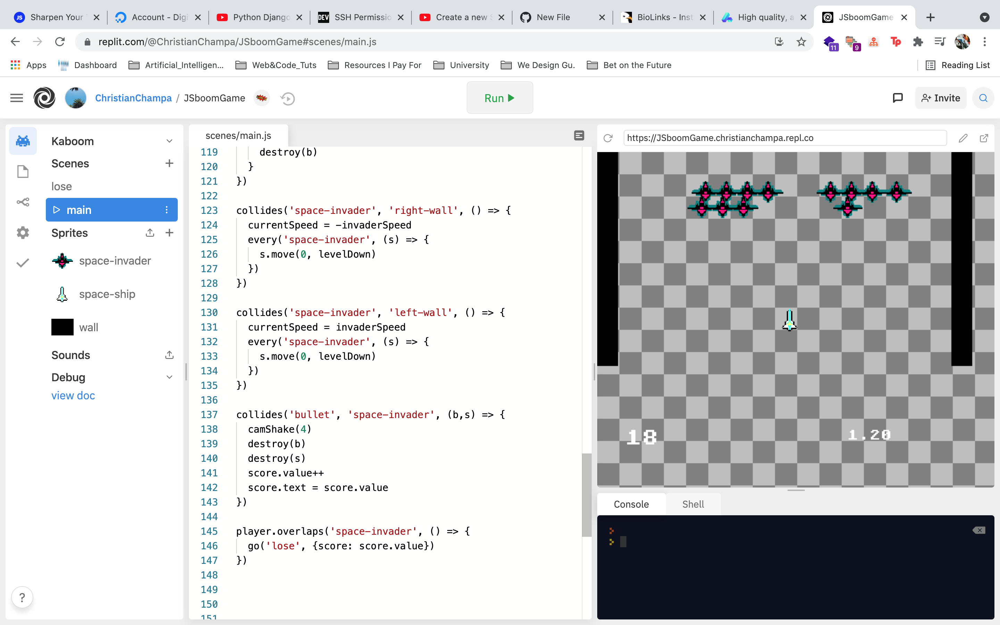

It's been a few weeks since my last blog entry. I haven't touched much as much Machine Learning content lately, as I've been focusing primarily on job searching and staying on top of my college courses with University of the People. I've also been a bit more active on LinkedIn, and surprisingly enough after resharing a single Quantum / Artificial Intelligence post, I saw over 20,000 views of my post. Surprising, because it was just a reshare and it gained about 25 reactions (likes, hearts, etc). Statistically speaking, this is like a 1% engagement rating so although it was viral according to one number, the "true" marker of success (reactions) was somewhat low comparitively. 

## You can see 20,000 views, but only 25 reactions

On that note, I've tried to be more conscious of my time with technology. Overworking in a single day is a recipe for disaster and burnout as a programmer. The same rule applies if I were to focus full time on being a musician. Right now my main goals are to complete college courses this term to inch towards my Associate's degree in Computer Science, so I spend about 10-20 hours a week on college work. I usually spend another 10-20 hours reading (currently on Eloquent Javascript and Principia of Isaac Newton) or working on personal coding projects. 

This past 4th of July Weekend I have been working on my LAMP server I made using DigitalOcean droplets. LAMP stands for Linux, Apache, MySQL andPHP/Perl/Python, running Ubuntu. It's been interesting setting up strictly using Linux on the commandline, and a bit frustrating but fun having to configure secure ssh connections. Soon though I'll be able to start launching some fun little apps here, and I feel like I'm growing a lot as a Web Developer, migrating into a pure LAMP Ubuntu environment from the good old Cpanel on BlueHost or GoDaddy. 

## What setup looks like 
 

## Connecting via the terminal, ssh and linux commands. Also note, UFW (Uncomplicated Firewall) and fail2ban security measures! :)  

## Have yet to configure or load much. I'm planning to experiment with several sites on one server, or multiple droplets for different sites.

I just finished a clone of SpaceInvaders using Kaboom.js on replit.com, and it was surprisingly easy to follow. They syntax for the framework was a bit unfamiliar but it was surprisingly fast. You can watch the tutorial for Kaboom.js games [here](https://www.youtube.com/watch?v=4OaHB0JbJDI&t=2852s). There is also a Super Mario clone I am working on right now.

## Kaboom.JS games

I also messed around a bit with e.rip after seeing it mentioned in Elon Musk's instagram bio, curious as to what it was. e.rip seems to be a link-shortener and "map" of sorts to host all kinds of links in one place, as well as see full analytics of what's going on. Visitors, visitor ip's, and click amount are all viewable. I made a quick page at [e.rip/openspace](https://e.rip/openspace) and it's pretty cool how quickly you can design together a nice looking page. After researching more, it seems like e.rip is built on a codebase called Biolinks made in php, as found [here](https://codecanyon.net/item/biolink-boost-instagram-bio-linking/20740546) and it appears that [AltumCode](https://altumcode.com/) was the original author of this code. Extremely interesting information after seeing how simple e.rip is to use.   

## e.rip Analytics, block building for "link collection" pages.

As for college, I am taking a course in Ethics and Morality, and Programming I which is using Java. 

Hope to see you all soon, with a few more coding projects and updates as they come along. I'll also be updating the blogs features and functionality in the near future, so please stay tuned!

Best wishes from the Pacific North,
Chris

